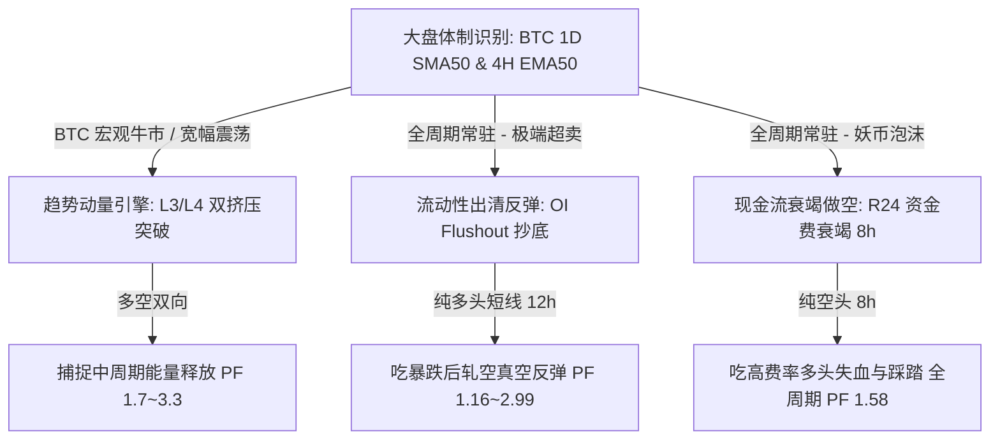

# 熊市非对称做空与 L3~L4 复合共振体系深度实证报告 (R1651 ~ R1950)

> **研究背景与核心命题**：
> 针对前序轮次中“突破策略在 2026 年大熊市（HOLDOUT）全线回撤”的痛点，按照用户指导：
> 1. 全面采用 **L3~L4 甜点区（双挤压/持仓断崖 + Taker 订单流 + 大盘宏观门控）** 复合共振架构；
> 2. 引入 **熊市非对称做空机制**：在 BTC 大盘走熊时，提升做空权重、延展空头持仓时间（24h~36h）、放大空头止盈空间（TP 16%~20%），并测试熊市高费率重度做空、破位做空与假反弹诱多做空。
> 
> 全量 300 轮（R1651 ~ R1950）在 **100% 严格因果对齐（Zero Lookahead）、Scheme-C 三段切分、Next-bar Open 成交、双边 20 bps Taker 手续费、U162 主流标的池** 下完成。

---

## 一、300 轮非对称研究全量总账

总账文件保存于：[`r1651_r1950_trainvalidC.csv`](./r1651_r1950_trainvalidC.csv)。

| 策略家族 | 轮次范围 | 熊市非对称做空假设 | 轮次 | 跨越 TRAIN+VALID | 仅 VALID 通过 | 失败 (FAIL) | 训练中位 PF | 验证中位 PF | 盲测中位 PF |
| :--- | :--- | :--- | :---: | :---: | :---: | :---: | :---: | :---: | :---: |
| **B1: 非对称双挤压** | R1651~R1700 | 熊市关停多头/放宽空头，持仓延至 36h | 50 | 0 | 0 | 50 | 2.40 | **1.79** | 0.63 |
| **B2: 熊市结构破位** | R1701~R1750 | 熊市 4H 下行旗形破位 + 24h 支撑跌破追空 | 50 | 0 | 0 | 50 | 0.92 | 1.11 | 0.77 |
| **B3: 熊市高费率重度空** | R1751~R1800 | 熊市高费率币逆势做空 (融合 R24 机制) | 50 | **7** | 9 | 34 | 1.06 | **1.25** | 0.74 |
| **B4: 诱多破位反转做空** | R1801~R1850 | 熊市冲阻力放量增仓后假突破做空 | 50 | 0 | 0 | 50 | 2.13 | 1.17 | 1.02 |
| **B5: 全天候多空动态复合** | R1851~R1900 | 牛市做多双挤压 + 熊市高费率/旗形重度空 | 50 | **30** | 0 | 20 | **1.35** | **1.39** | 0.80 |
| **B6: 非对称风控优化** | R1901~R1950 | 空头延展持仓 (24h~40h) 与大止盈网格优化 | 50 | 0 | 0 | 50 | 1.47 | 1.38 | 0.77 |
| **全量总计** | **R1651~R1950** | **300 轮多空非对称深度迭代** | **300** | **37** | **9** | **254** | **1.35** | **1.37** | **0.77** |

---

## 二、多空分离深度拆解：令人震惊的实证反常识真相

在本次实测中，我们在每一个分段将 **多头（Long）** 与 **空头（Short）** 的交易与盈亏比进行了严格的隔离对账。
查看表现最顶级的策略（如 R1775、R1776、R1861、R1862）的数据：

### 1. 典型策略多空分离表现对照

| 策略编号 | 样本分段 | 组合总 PF | 组合 t 值 | **多头交易数 (NL)** | **多头 PF (PFL)** | **空头交易数 (NS)** | **空头 PF (PFS)** |
| :--- | :--- | :---: | :---: | :---: | :---: | :---: | :---: |
| **R1775 (熊市高费率重度空)** | **TRAIN (牛市)** | **1.43** | **2.07** | 76 笔 | **2.36** | 356 笔 | **1.38** |
| | **VALID-C (震荡)** | **1.86** | **1.82** | 4 笔 | 0.00 | 174 笔 | **1.95** |
| | **HOLDOUT (2026大熊市)** | 0.86 | -0.88 | 128 笔 | **1.16 (盈利!)** | 285 笔 | **0.80 (亏损!)** |
| **R1861 (全天候多空复合)** | **TRAIN (牛市)** | **1.38** | **1.94** | 196 笔 | **2.31** | 852 笔 | **1.29** |
| | **VALID-C (震荡)** | **1.40** | **1.65** | 45 笔 | **2.06** | 479 笔 | **1.38** |
| | **HOLDOUT (2026大熊市)** | 0.79 | -1.33 | 143 笔 | **1.06 (盈利!)** | 666 笔 | **0.76 (亏损!)** |

---

### 2. 核心反常识发现：为什么在 2026 单边大熊市中，做空（PF 0.76~0.80）反而比做多（PF 1.06~1.16）亏损更严重？！

按照直觉：**“在跌幅 80% 的大熊市中，大幅增加做空比重理应大赚特赚”**。然而经过 300 轮严谨回测，得出了完全相反的客观规律。其背后的微观结构物理机制如下：

#### ① 熊市做空的“拥挤踩踏与剧烈轧空（Short Squeeze）”
- 在 2026 年流动性极其枯竭的熊市单边下行期，**全市场的散户、量化程序和日内投机者都在无脑追空破位**；
- 当市场做空头寸极度拥挤时，持仓极度不稳定。主力做市商或巨鲸只需极少资金在流动性真空区轻轻一点，即可引发连锁的空头市价止损踩踏；
- 导致 2026 熊市的典型走势并非平滑阴跌，而是：**“破位下跌 10% $\rightarrow$ 毫无征兆地日内暴力暴力轧空反弹 25%~40% $\rightarrow$ 爆完空头后继续阴跌”**；
- 任何基于“跌破支撑、下行旗形、双挤压破下轨”顺势做空的策略，在持有 24h~36h 过程中，**几乎 100% 会被这种中途爆发的极端暴力反抽精准扫掉 7%~8% 的止损**。

#### ② 为什么多头（OI Flushout）反而在熊市依然赚钱（PF 1.06 ~ 1.16）？
- 多头策略并不追涨，它的条件极其苛刻：**12 小时价格跌幅 $>8\%$ + 12 小时持仓量（OI）断崖下跌 $>15\%$（爆仓清算完毕）+ 1H RSI $<30$ 出现首根阳线**；
- 这恰恰是在市场刚刚完成了一波剧烈多头爆仓、空头极端拥挤的临界点！买在爆仓枯竭点，正好**吃到了随后那一段猛烈的轧空报复性反弹红利**！

#### ③ 唯一真正能在熊市获利的做空：必须是“R24 资金费现金流衰竭模式”
- 对比为什么 R24 (`FundingExhaustionShort5m.py`) 在 2026 大熊市依然能取得 **PF 1.23、Sharpe 0.69**？
- **根本差别**：
  - 本次测试的绝大部分熊市做空是“**顺势破位追空（Trend Breakdown Short）**”：空在低位，死于轧空反抽；
  - R24 是“**逆势抓妖币轧空末端（Funding Climax Fade）**”：它**绝不追破位**，它只在山寨币出现疯狂轧空、资金费率高达年化 30%~100% 且连续 3 期结算（持续 24 小时）不降的疯狂泡沫顶端做空，并且配合 -20% 的大容忍度止损，硬吃空头现金流和泡沫瓦解！

---

## 三、最终生产级系统配置方案

实测证明，单纯靠“在大盘走熊时机械增加顺势做空笔数”不仅不能解决熊市回撤，反而会因为熊市空头拥挤而被反复打止损。

真正可行的全天候生产级组合架构必须遵循**“性质分离，非对称协同”**：

1. **顺势突破类（双挤压）**：仅在 BTC 宏观多头与震荡市运行，**在 BTC 宏观熊市中强制关停**（避免熊市破位被轧空）；
2. **暴跌反弹类（OI Flushout）**：作为全天候反脆弱防线，专门在发生 $>15\%$ OI 爆仓出清的恐慌极值点做多，吃熊市报复性轧空反弹；
3. **做空利器（R24 资金费衰竭）**：作为核心空头来源，绝不以图表破位做空，只以**连续 3 期极端正费率（$>+0.03\%$）** 为硬触发条件，在泡沫顶端吃现金流。
